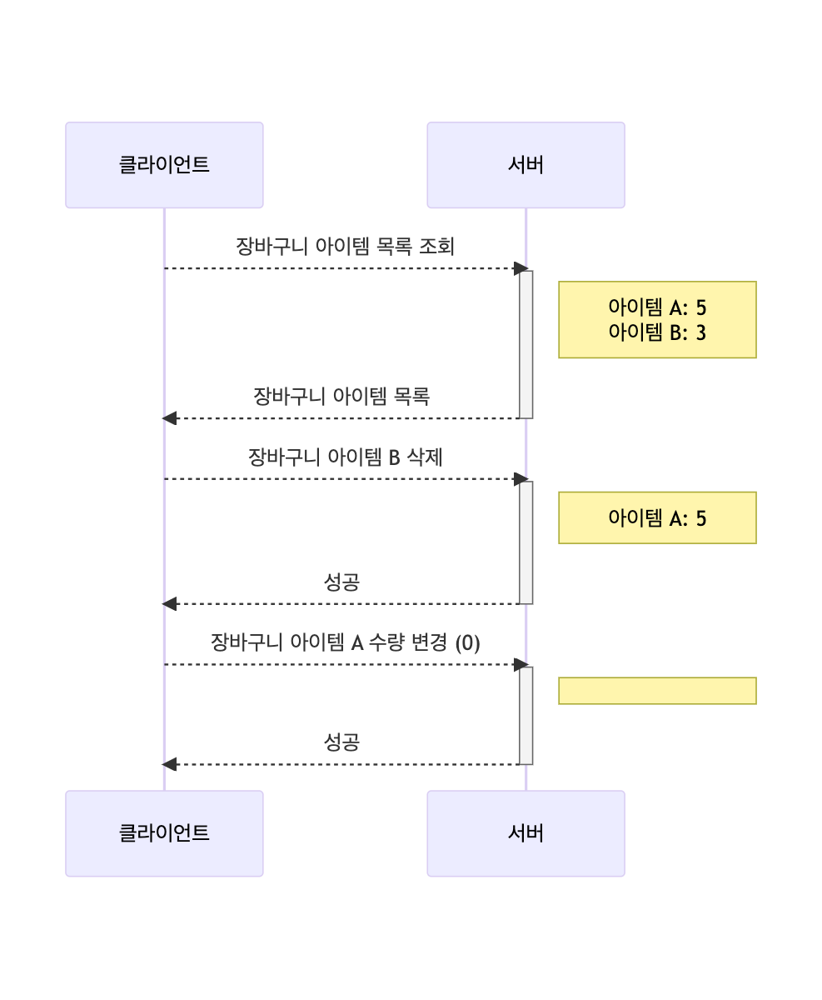

# spring-gift-wishlist

## 🚀 👋위시 리스트

---
### 기능 요구 사항
- [X] 위시 리스트에 등록된 상품 목록 조회
- [X] 위시 리스트에 상품 추가
- [X] 위시 리스트에 상품 제거

### 사용자 시나리오
**위시 리스트 상품 추가**


**위시 리스트 상품 삭제**


## **🚀 👋사용자 인증**

---
### 기능 요구 사항

- 사용자가 로그인할 수 있다.
- 사용자별 기능을 사용할 수 있도록 구현한다.

아래 예시와 같이 HTTP 메시지를 주고받도록 구현한다.

**Request**

```diff
POST /login/token HTTP/1.1
content-type: application/json
host: localhost:8080

{
    "password": "password",
    "email": "admin@email.com"
}

```

**Response**

```diff
HTTP/1.1 200 
Content-Type: application/json

{
    "accessToken": ""
}

```

### 구현 List

- [X]  User Schema.sql 작성
- [X]  UserDto 작성
- [X]  User 객체 클래스 작성
- [X]  인증하는 부분 작성

## 🚀 유효성 검사 및 예외 처리

---
### 기능 요구 사항

🗣️상품을 추가하거나 수정할 때, 클라이언트로부터 잘못된 값이 전달될 수 있다.

잘못된 값이 전달되면 클라이언트가 어떤 부분이 왜 잘못되었는지 인지할 수 있도록 응답을 제공한다.

- [X] 상품 이름: 공백 포함 최대 15자, Null 허용X
- [X] 특수 문자
  - 가능: (), [], +, -, &, /, -
  - 그 외 특수 문자 불가
- [X] “카카오”가 포함된 문구는 담당 MD와 협의한 경우에만 사용 가능
- [X] 가격 입력 Null 허용X

## **🚀사용자 인증**

---
### 기능 요구 사항

- 사용자가 로그인할 수 있다.
- 사용자별 기능을 사용할 수 있도록 구현한다.

아래 예시와 같이 HTTP 메시지를 주고받도록 구현한다.

**Request**

```diff
POST /login/token HTTP/1.1
content-type: application/json
host: localhost:8080

{
    "password": "password",
    "email": "admin@email.com"
}

```

**Response**

```diff
HTTP/1.1 200 
Content-Type: application/json

{
    "accessToken": ""
}

```

### 구현 List

- [X]  User Schema.sql 작성
- [X]  UserDto 작성
- [X]  User 객체 클래스 작성
- [X]  인증하는 부분 작성
