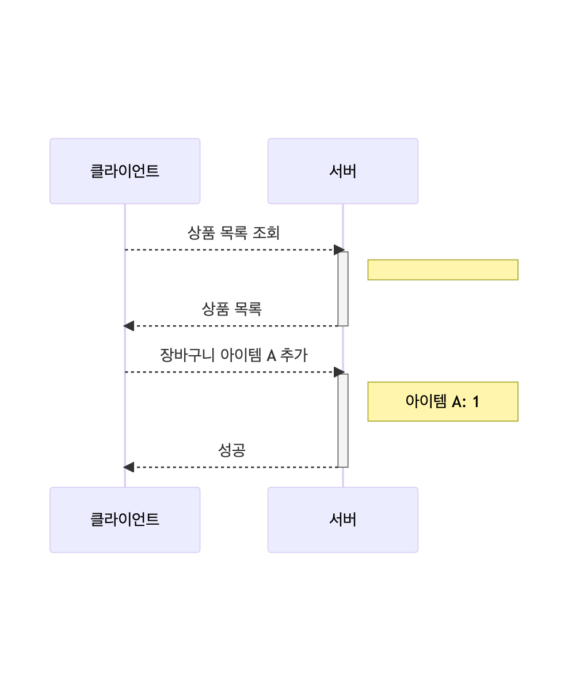
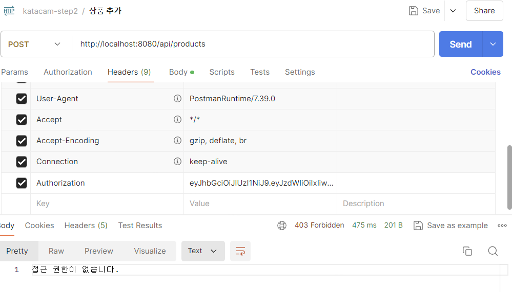
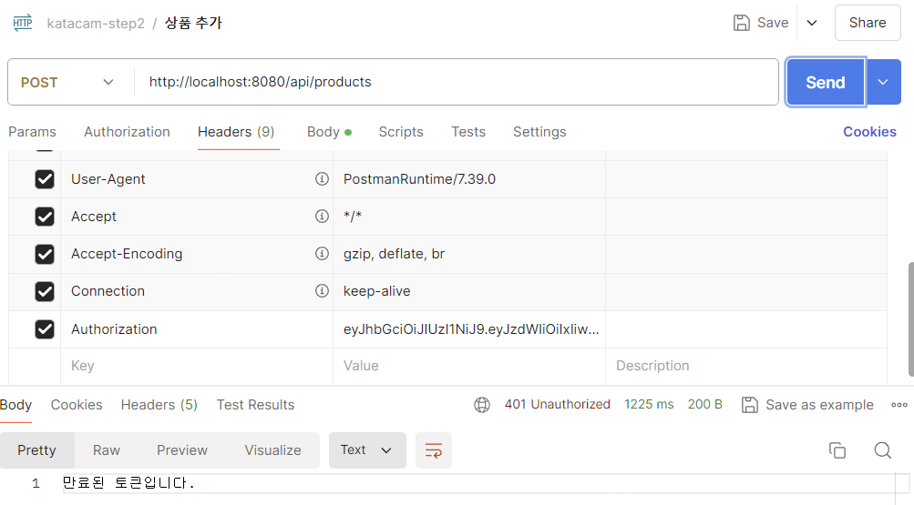
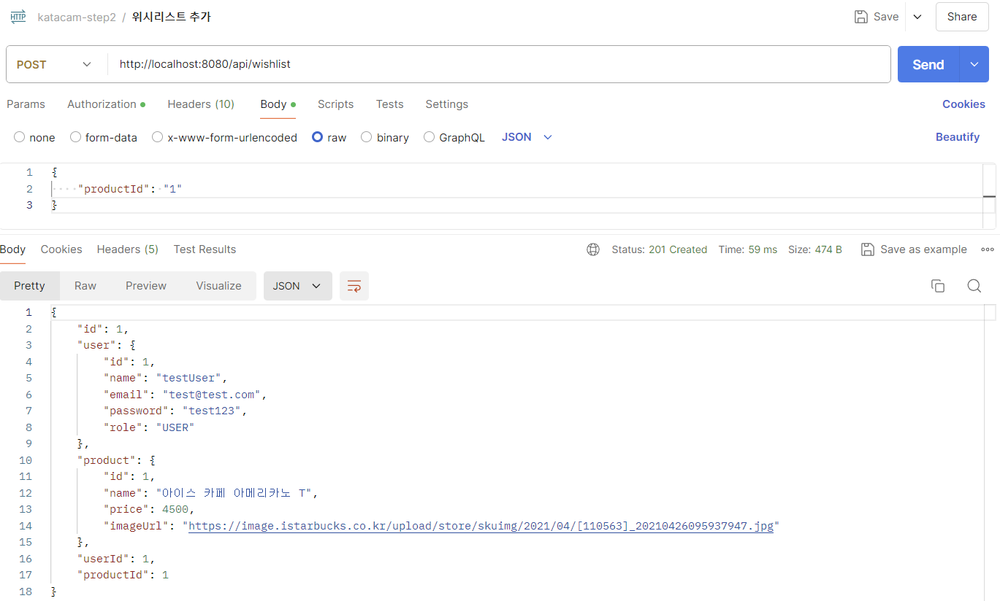

# spring-gift-wishlist

## 1단계 - 유효성 검사 및 예외 처리
> <<상품 추가, 수정 시>>   
> 클라이언트로부터 잘못된 값이 전달되면 클라이언트가 어떤 부분이 왜 잘못되었는지 인지할 수 있도록 응답   
> 상품 이름은 공백 포함 15자 이내   
> (, ), [, ], +, -, &, /, _ 외의 특수 문자 불가   
> "카카오"가 포함된 문구는 담당 MD와 협의한 경우에만 사용 가능

### 기능 요구사항 목록
- [x] 입력 필드가 null인 경우 처리
  - 공백만으로 구성된 경우도 예외로 가정
- [x] 상품 가격이 범위를 벗어나는 경우 처리
  - 최대 가격은 int 자료형의 최댓값으로 가정
- [x] 상품 가격에 정수로 치환 불가능한 값이 입력된 경우 처리
- [x] 형식에 맞지 않는 URL이 입력된 경우 처리
- [x] 상품 이름이 15자를 초과하는 경우 처리
  - 문자열 앞뒤에 공백이 포함된 경우는 유효한 것으로 가정
- [x] 상품 이름에 불가능한 특수 문자가 입력된 경우 처리
  - (대)괄호의 쌍이 맞지 않는 경우는 유효한 것으로 가정
- [x] 상품 이름에 "카카오" 문구가 포함된 경우 처리

## 2단계 - 회원 로그인
> 사용자가 회원 가입, 로그인, 추후 회원별 기능 이용이 가능하도록 구현한다.   
> 사용자는 토큰을 발급 받기 위해 이메일과 비밀번호를 보내야 하며,   
> 가입한 이메일과 비밀번호가 일치하면 토큰이 발급된다.   
> 아래 예시와 같이 HTTP 메시지를 주고 받도록 구현한다.   
> 
> ### 회원 가입
> #### Request
> ```
> POST /members/register HTTP/1.1
> content-type: application/json
> host: localhost:8080
>
> {
>     "email": "admin@email.com",
>     "password": "password"
> }   
> ```
> #### Response
> ```
> HTTP/1.1 200
> Content-Type: application/json
>
> {
>     "token": ""
> }
> ```
> 
> ### 로그인
> #### Request
> ```
> POST /members/login HTTP/1.1
> content-type: application/json
> host: localhost:8080
>
> {
>     "email": "admin@email.com",
>     "password": "password"
> }
> ```
> #### Response
> ```
> HTTP/1.1 200
> Content-Type: application/json
>
> {
>     "token": ""
> }
> 
> ```


### 기능 요구사항 목록
- [x] DB에 회원 테이블 생성
  - SQL Schema 작성
- [x] 사용자 클래스 작성
- [x] 회원 가입 기능 구현
  
- [x] 로그인 기능 구현
  
  - 권한이 낮은 경우 `403 Forbidden` 반환
    
  - 헤더나 토큰이 유효하지 않은 경우 `401 Unauthorized` 반환
    
  - 비밀번호가 틀린 경우 `400 Bad Reqeust` 반환
        

## 3단계 - 위시 리스트
> 2단계에서 로그인 후 받은 토큰을 사용하여 사용자별 위시 리스트 기능을 구현한다.

### 기능 요구사항 목록
- [x] 위시 리스트 테이블 만들기
- [x] 위시 리스트 객체 만들기
- [x] 위시 리스트에 상품 추가
  
- [ ] 위시 리스트 조회
  - 전체 상품 조회
  - 특정 상품 조회
  - 존재하지 않는 상품 조회
- [ ] 위시 리스트의 상품 삭제
  - 전체 삭제
  - 특정 상품 삭제
  - 존재하지 않는 상품 삭제